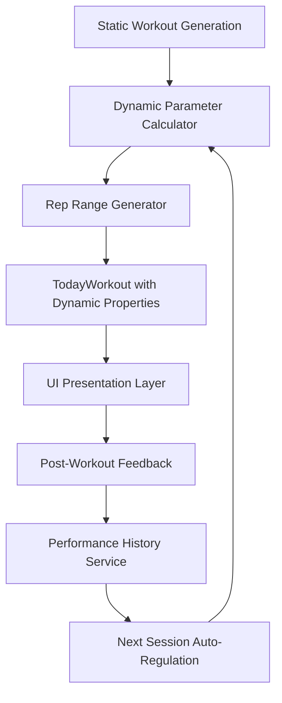

# SwiftUI Architecture Plan: Fitbod-Style Dynamic Rep Programming

## Executive Summary

This document provides a comprehensive SwiftUI architecture for implementing intelligent, adaptive workout programming that transitions from static recommendations (3×8, 3×10) to Fitbod-style dynamic rep ranges with workout-to-workout adaptation.

**Architecture Goals:**
- Extend existing WorkoutManager without breaking functionality
- Implement reactive state management for dynamic parameters
- Design performance feedback collection with minimal UX friction
- Create reliable fallback mechanisms for robustness
- Enable gradual migration from static to dynamic programming

## 1. Core Architecture Overview

### 1.1 Enhanced State Management Pattern

The architecture extends the existing singleton `WorkoutManager` pattern with reactive dynamic programming capabilities:

```swift
@MainActor
class WorkoutManager: ObservableObject {
    // EXISTING: Static workout generation
    @Published private(set) var todayWorkout: TodayWorkout?
    
    // NEW: Dynamic programming state
    @Published private(set) var dynamicParameters: DynamicWorkoutParameters?
    @Published private(set) var sessionPhase: SessionPhase = .strengthFocus
    @Published private(set) var performanceHistory: PerformanceHistory?
    @Published private(set) var recoveryStatus: [String: RecoveryStatus] = [:]
    
    // NEW: Feedback collection state
    @Published var pendingFeedback: WorkoutSessionFeedback?
    @Published private(set) var feedbackCollectionState: FeedbackCollectionState = .none
}
```

### 1.2 Data Flow Architecture



## 2. New Data Models & Services

### 2.1 Core Dynamic Models

```swift
// MARK: - Dynamic Programming Models

struct DynamicWorkoutParameters: Codable, Equatable {
    let sessionPhase: SessionPhase
    let recoveryStatus: [String: RecoveryStatus]
    let performanceHistory: PerformanceMetrics
    let autoRegulationLevel: Double // 0.0 - 1.0 (conservative to aggressive)
    let lastWorkoutFeedback: WorkoutSessionFeedback?
    
    // Computed properties for algorithm decisions
    var shouldIncreaseDifficulty: Bool {
        guard let feedback = lastWorkoutFeedback else { return false }
        return feedback.overallRPE < 6.0 && feedback.completionRate > 0.9
    }
    
    var shouldDecreaseDifficulty: Bool {
        guard let feedback = lastWorkoutFeedback else { return false }
        return feedback.overallRPE > 8.0 || feedback.completionRate < 0.7
    }
}

enum SessionPhase: String, CaseIterable, Codable {
    case strengthFocus = "strength"     // Lower reps, higher intensity
    case volumeFocus = "volume"         // Higher reps, moderate intensity  
    case conditioningFocus = "conditioning" // Circuit-style, time-based
    
    var displayName: String {
        switch self {
        case .strengthFocus: return "Strength Focus"
        case .volumeFocus: return "Volume Focus"
        case .conditioningFocus: return "Conditioning Focus"
        }
    }
    
    var description: String {
        switch self {
        case .strengthFocus: return "Building maximum strength with lower reps"
        case .volumeFocus: return "Muscle growth with higher volume"
        case .conditioningFocus: return "Endurance and conditioning work"
        }
    }
    
    func nextPhase() -> SessionPhase {
        switch self {
        case .strengthFocus: return .volumeFocus
        case .volumeFocus: return .conditioningFocus
        case .conditioningFocus: return .strengthFocus
        }
    }
}

enum RecoveryStatus: String, CaseIterable, Codable {
    case fresh = "fresh"           // 0-24 hours since last workout
    case moderate = "moderate"     // 24-48 hours
    case fatigued = "fatigued"     // 48+ hours but high training load
    
    var intensityMultiplier: Double {
        switch self {
        case .fresh: return 1.0
        case .moderate: return 0.9
        case .fatigued: return 0.8
        }
    }
}

struct WorkoutSessionFeedback: Codable, Identifiable {
    let id = UUID()
    let workoutId: UUID
    let overallRPE: Double           // 1-10 scale (Rate of Perceived Exertion)
    let difficultyRating: DifficultyRating
    let completionRate: Double       // 0.0-1.0 (percentage completed)
    let exerciseFeedback: [String: ExerciseFeedback] // Exercise ID -> feedback
    let timestamp: Date
    
    enum DifficultyRating: String, CaseIterable, Codable {
        case tooEasy = "too_easy"
        case justRight = "just_right"  
        case challenging = "challenging"
        case tooHard = "too_hard"
        
        var rpeRange: ClosedRange<Double> {
            switch self {
            case .tooEasy: return 1.0...4.0
            case .justRight: return 5.0...7.0
            case .challenging: return 7.0...8.5
            case .tooHard: return 8.5...10.0
            }
        }
    }
}

struct ExerciseFeedback: Codable {
    let exerciseId: Int
    let completedSets: Int
    let completedReps: [Int]  // Actual reps per set
    let usedWeight: Double?
    let perceivedDifficulty: Double // 1-10 scale
}
```

### 2.2 Enhanced Exercise Models

```swift
// MARK: - Enhanced Exercise Models

struct DynamicWorkoutExercise: Codable, Hashable, Identifiable {
    let id = UUID()
    let exercise: ExerciseData
    
    // DYNAMIC: Rep ranges instead of fixed numbers
    let setCount: Int
    let repRange: ClosedRange<Int>  // e.g., 8...12 instead of fixed 10
    let targetIntensity: IntensityZone
    let suggestedWeight: Double?
    let restTime: Int
    
    // Static compatibility
    let notes: String?
    let warmupSets: [WarmupSetData]?
    
    // Computed properties for UI display
    var repRangeDisplay: String {
        if repRange.lowerBound == repRange.upperBound {
            return "\(repRange.lowerBound)"  // "10" for fixed reps
        } else {
            return "\(repRange.lowerBound)-\(repRange.upperBound)"  // "8-12" for ranges
        }
    }
    
    var setsAndRepsDisplay: String {
        return "\(setCount) × \(repRangeDisplay)"
    }
    
    // Backward compatibility with existing TodayWorkoutExercise
    var legacyExercise: TodayWorkoutExercise {
        TodayWorkoutExercise(
            exercise: exercise,
            sets: setCount,
            reps: repRange.upperBound, // Use upper bound as default
            weight: suggestedWeight,
            restTime: restTime,
            notes: notes,
            warmupSets: warmupSets
        )
    }
}

enum IntensityZone: String, CaseIterable, Codable {
    case strength = "strength"        // 1-6 reps, 80-95% 1RM
    case hypertrophy = "hypertrophy"  // 6-15 reps, 65-80% 1RM
    case endurance = "endurance"      // 15+ reps, 50-65% 1RM
    
    var repRange: ClosedRange<Int> {
        switch self {
        case .strength: return 3...6
        case .hypertrophy: return 8...15
        case .endurance: return 15...25
        }
    }
    
    var restTime: Int {
        switch self {
        case .strength: return 180  // 3 minutes
        case .hypertrophy: return 90   // 90 seconds
        case .endurance: return 60     // 1 minute
        }
    }
}
```

## 3. Service Layer Architecture

### 3.1 Dynamic Parameter Calculator Service

```swift
// MARK: - Dynamic Parameter Calculator

@MainActor
class DynamicParameterService: ObservableObject {
    static let shared = DynamicParameterService()
    
    private let performanceHistoryService = PerformanceHistoryService.shared
    private let recoveryService = MuscleRecoveryService.shared
    
    private init() {}
    
    /// Calculate dynamic parameters for next workout
    func calculateDynamicParameters(
        currentPhase: SessionPhase,
        lastFeedback: WorkoutSessionFeedback?
    ) async -> DynamicWorkoutParameters {
        
        let recoveryStatus = await calculateRecoveryStatus()
        let performanceMetrics = await performanceHistoryService.getRecentMetrics()
        let autoRegulationLevel = calculateAutoRegulationLevel(from: performanceMetrics)
        
        return DynamicWorkoutParameters(
            sessionPhase: determineNextPhase(currentPhase, feedback: lastFeedback),
            recoveryStatus: recoveryStatus,
            performanceHistory: performanceMetrics,
            autoRegulationLevel: autoRegulationLevel,
            lastWorkoutFeedback: lastFeedback
        )
    }
    
    /// Generate rep ranges for specific exercise
    func generateRepRange(
        for exercise: ExerciseData,
        parameters: DynamicWorkoutParameters,
        fitnessGoal: FitnessGoal
    ) -> DynamicWorkoutExercise {
        
        let exerciseType = classifyExercise(exercise)
        let baseIntensityZone = determineIntensityZone(
            sessionPhase: parameters.sessionPhase,
            exerciseType: exerciseType,
            fitnessGoal: fitnessGoal
        )
        
        let repRange = adjustRepRangeForRecovery(
            baseRange: baseIntensityZone.repRange,
            recoveryStatus: parameters.recoveryStatus[exercise.target] ?? .moderate,
            lastFeedback: parameters.lastWorkoutFeedback
        )
        
        let setCount = determineSetCount(
            exerciseType: exerciseType,
            sessionPhase: parameters.sessionPhase,
            fitnessGoal: fitnessGoal
        )
        
        return DynamicWorkoutExercise(
            exercise: exercise,
            setCount: setCount,
            repRange: repRange,
            targetIntensity: baseIntensityZone,
            suggestedWeight: calculateSuggestedWeight(for: exercise, parameters: parameters),
            restTime: baseIntensityZone.restTime,
            notes: nil,
            warmupSets: nil
        )
    }
    
    // MARK: - Private Calculation Methods
    
    private func determineNextPhase(_ currentPhase: SessionPhase, feedback: WorkoutSessionFeedback?) -> SessionPhase {
        // Simple A-B-C cycling, but could be enhanced with feedback analysis
        return currentPhase.nextPhase()
    }
    
    private func determineIntensityZone(
        sessionPhase: SessionPhase,
        exerciseType: ExerciseType,
        fitnessGoal: FitnessGoal
    ) -> IntensityZone {
        switch (sessionPhase, exerciseType, fitnessGoal) {
        case (.strengthFocus, .compound, _):
            return .strength
        case (.volumeFocus, .compound, .muscleGain):
            return .hypertrophy
        case (.conditioningFocus, _, _):
            return .endurance
        case (_, .isolation, .muscleGain):
            return .hypertrophy
        default:
            return .hypertrophy  // Safe default
        }
    }
    
    private func adjustRepRangeForRecovery(
        baseRange: ClosedRange<Int>,
        recoveryStatus: RecoveryStatus,
        lastFeedback: WorkoutSessionFeedback?
    ) -> ClosedRange<Int> {
        
        var lowerBound = baseRange.lowerBound
        var upperBound = baseRange.upperBound
        
        // Adjust based on recovery
        switch recoveryStatus {
        case .fresh:
            lowerBound = max(lowerBound - 2, 3)  // Allow lower reps for strength
        case .moderate:
            break  // Keep base range
        case .fatigued:
            lowerBound = lowerBound + 2  // Force higher reps for recovery
            upperBound = upperBound + 3
        }
        
        // Adjust based on last workout feedback
        if let feedback = lastFeedback {
            if feedback.overallRPE < 5.0 {  // Too easy
                lowerBound = max(lowerBound - 2, 3)
                upperBound = max(upperBound - 1, lowerBound)
            } else if feedback.overallRPE > 8.0 {  // Too hard
                lowerBound = lowerBound + 1
                upperBound = upperBound + 2
            }
        }
        
        return lowerBound...upperBound
    }
    
    private func calculateSuggestedWeight(for exercise: ExerciseData, parameters: DynamicWorkoutParameters) -> Double? {
        // Integration point with existing weight progression logic
        // Could use historical data + auto-regulation
        return nil  // Let existing system handle for now
    }
}

enum ExerciseType: String, CaseIterable {
    case compound = "compound"      // Multi-joint movements
    case isolation = "isolation"    // Single-joint movements
    case cardio = "cardio"          // Cardio exercises
    
    func determineFromExercise(_ exercise: ExerciseData) -> ExerciseType {
        let compoundKeywords = ["squat", "deadlift", "press", "pull", "row", "chin", "dip"]
        let exerciseName = exercise.name.lowercased()
        
        for keyword in compoundKeywords {
            if exerciseName.contains(keyword) {
                return .compound
            }
        }
        
        if exercise.category.lowercased().contains("cardio") {
            return .cardio
        }
        
        return .isolation
    }
}
```

### 3.2 Performance Feedback Service

```swift
// MARK: - Performance Feedback Service

@MainActor  
class PerformanceFeedbackService: ObservableObject {
    static let shared = PerformanceFeedbackService()
    
    @Published private(set) var feedbackHistory: [WorkoutSessionFeedback] = []
    @Published var currentFeedback: WorkoutSessionFeedback?
    
    private let feedbackStorageKey = "workoutFeedbackHistory"
    
    private init() {
        loadFeedbackHistory()
    }
    
    /// Collect post-workout feedback with minimal UX friction
    func collectFeedback(for workout: TodayWorkout) -> WorkoutSessionFeedback {
        // Initialize with smart defaults based on completion
        let estimatedRPE = estimateRPEFromCompletion(workout)
        
        return WorkoutSessionFeedback(
            workoutId: workout.id,
            overallRPE: estimatedRPE,
            difficultyRating: .justRight,  // Default assumption
            completionRate: 1.0,  // Assume full completion initially
            exerciseFeedback: [:],
            timestamp: Date()
        )
    }
    
    /// Save feedback and trigger next workout adaptation
    func submitFeedback(_ feedback: WorkoutSessionFeedback) {
        feedbackHistory.append(feedback)
        saveFeedbackHistory()
        
        // Trigger next workout adaptation
        Task {
            await triggerWorkoutAdaptation(feedback)
        }
    }
    
    /// Get recent performance trends for auto-regulation
    func getPerformanceTrends() -> PerformanceMetrics {
        let recentFeedback = Array(feedbackHistory.suffix(5))  // Last 5 workouts
        let averageRPE = recentFeedback.map(\.overallRPE).reduce(0, +) / Double(recentFeedback.count)
        let averageCompletion = recentFeedback.map(\.completionRate).reduce(0, +) / Double(recentFeedback.count)
        
        return PerformanceMetrics(
            averageRPE: averageRPE,
            averageCompletionRate: averageCompletion,
            recentFeedbackCount: recentFeedback.count,
            trend: determineTrend(recentFeedback)
        )
    }
    
    // MARK: - Private Methods
    
    private func estimateRPEFromCompletion(_ workout: TodayWorkout) -> Double {
        // Basic heuristic: if user completed full workout, assume moderate effort
        return 6.5  // Could be enhanced with actual completion tracking
    }
    
    private func triggerWorkoutAdaptation(_ feedback: WorkoutSessionFeedback) async {
        let workoutManager = WorkoutManager.shared
        await workoutManager.adaptNextWorkout(based: feedback)
    }
    
    private func loadFeedbackHistory() {
        guard let data = UserDefaults.standard.data(forKey: feedbackStorageKey),
              let history = try? JSONDecoder().decode([WorkoutSessionFeedback].self, from: data) else {
            return
        }
        feedbackHistory = history
    }
    
    private func saveFeedbackHistory() {
        guard let data = try? JSONEncoder().encode(feedbackHistory) else { return }
        UserDefaults.standard.set(data, forKey: feedbackStorageKey)
    }
}

struct PerformanceMetrics: Codable {
    let averageRPE: Double
    let averageCompletionRate: Double
    let recentFeedbackCount: Int
    let trend: PerformanceTrend
}

enum PerformanceTrend: String, Codable {
    case improving = "improving"
    case stable = "stable"
    case declining = "declining"
}
```

## 4. Enhanced WorkoutManager Integration

### 4.1 Extended WorkoutManager Methods

```swift
// MARK: - WorkoutManager Dynamic Extensions

extension WorkoutManager {
    
    // MARK: - Dynamic Workout Generation
    
    /// Generate dynamic workout with intelligent adaptation
    func generateDynamicWorkout() async {
        await setGenerating(true, message: "Analyzing your recent performance...")
        
        do {
            // Calculate dynamic parameters
            let dynamicParams = await DynamicParameterService.shared.calculateDynamicParameters(
                currentPhase: sessionPhase,
                lastFeedback: PerformanceFeedbackService.shared.feedbackHistory.last
            )
            
            await setGenerating(true, message: "Optimizing rep ranges for your goals...")
            
            // Generate base workout structure (reuse existing logic)
            let baseWorkout = try await generateBaseWorkout()
            
            // Apply dynamic programming
            let dynamicWorkout = await applyDynamicProgramming(to: baseWorkout, parameters: dynamicParams)
            
            // Update state
            self.dynamicParameters = dynamicParams
            self.todayWorkout = dynamicWorkout.legacyWorkout  // Backward compatibility
            self.sessionPhase = dynamicParams.sessionPhase
            
            await setGenerating(true, message: "Finalizing your adaptive workout...")
            
            saveDynamicState()
            
        } catch {
            generationError = .generationFailed("Dynamic workout generation failed: \(error.localizedDescription)")
        }
        
        await setGenerating(false)
    }
    
    /// Adapt next workout based on performance feedback
    func adaptNextWorkout(based feedback: WorkoutSessionFeedback) async {
        guard let params = dynamicParameters else { return }
        
        // Update session phase if needed
        let shouldAdvancePhase = shouldAdvanceToNextPhase(feedback: feedback)
        if shouldAdvancePhase {
            sessionPhase = sessionPhase.nextPhase()
            print("📈 Advancing to next phase: \(sessionPhase.displayName)")
        }
        
        // Store feedback for next generation
        await PerformanceFeedbackService.shared.submitFeedback(feedback)
        
        // Trigger regeneration if user will see workout soon
        if Calendar.current.isDateInToday(Date()) {
            await generateDynamicWorkout()
        }
    }
    
    // MARK: - Migration & Compatibility
    
    /// Check if user should be migrated to dynamic programming
    var shouldUseDynamicProgramming: Bool {
        // Gradual rollout logic
        let userEmail = UserDefaults.standard.string(forKey: "userEmail") ?? ""
        let workoutCount = PerformanceFeedbackService.shared.feedbackHistory.count
        
        // Enable dynamic programming after user has completed 3+ workouts
        return workoutCount >= 3 && !userEmail.isEmpty
    }
    
    /// Fallback to static programming if dynamic fails
    private func fallbackToStaticProgramming() async {
        print("⚠️ Falling back to static programming due to error")
        await generateTodayWorkout()  // Use existing static method
    }
    
    // MARK: - Private Dynamic Methods
    
    private func generateBaseWorkout() async throws -> TodayWorkout {
        // Use existing workout generation logic
        return try await backgroundWorkoutGeneration(WorkoutGenerationParameters(
            duration: effectiveDuration,
            fitnessGoal: effectiveFitnessGoal,
            fitnessLevel: effectiveFitnessLevel,
            flexibilityPreferences: effectiveFlexibilityPreferences,
            customTargetMuscles: customTargetMuscles,
            customEquipment: customEquipment
        ))
    }
    
    private func applyDynamicProgramming(
        to workout: TodayWorkout,
        parameters: DynamicWorkoutParameters
    ) async -> DynamicTodayWorkout {
        
        let dynamicExercises = workout.exercises.map { staticExercise in
            DynamicParameterService.shared.generateRepRange(
                for: staticExercise.exercise,
                parameters: parameters,
                fitnessGoal: effectiveFitnessGoal
            )
        }
        
        return DynamicTodayWorkout(
            baseWorkout: workout,
            dynamicExercises: dynamicExercises,
            sessionPhase: parameters.sessionPhase
        )
    }
    
    private func shouldAdvanceToNextPhase(feedback: WorkoutSessionFeedback) -> Bool {
        // Simple logic: advance after each workout
        // Could be enhanced with performance analysis
        return feedback.completionRate > 0.8
    }
    
    private func saveDynamicState() {
        guard let params = dynamicParameters else { return }
        
        if let data = try? JSONEncoder().encode(params) {
            UserDefaults.standard.set(data, forKey: "dynamicWorkoutParameters")
        }
        
        UserDefaults.standard.set(sessionPhase.rawValue, forKey: "currentSessionPhase")
    }
}

// MARK: - Dynamic Workout Container

struct DynamicTodayWorkout {
    let baseWorkout: TodayWorkout
    let dynamicExercises: [DynamicWorkoutExercise]
    let sessionPhase: SessionPhase
    
    /// Backward compatibility with existing UI
    var legacyWorkout: TodayWorkout {
        let legacyExercises = dynamicExercises.map(\.legacyExercise)
        
        return TodayWorkout(
            id: baseWorkout.id,
            date: baseWorkout.date,
            title: "\(sessionPhase.displayName): \(baseWorkout.title)",
            exercises: legacyExercises,
            estimatedDuration: baseWorkout.estimatedDuration,
            fitnessGoal: baseWorkout.fitnessGoal,
            difficulty: baseWorkout.difficulty,
            warmUpExercises: baseWorkout.warmUpExercises,
            coolDownExercises: baseWorkout.coolDownExercises
        )
    }
}
```

## 5. UI Integration Strategy

### 5.1 Enhanced Exercise Display Components

```swift
// MARK: - Dynamic Exercise Card Component

struct DynamicExerciseCard: View {
    let dynamicExercise: DynamicWorkoutExercise
    let onExerciseSelected: () -> Void
    
    @Environment(\.workoutManager) private var workoutManager
    
    var body: some View {
        VStack(alignment: .leading, spacing: 12) {
            HStack {
                AsyncImage(url: exerciseImageURL) { image in
                    image.resizable()
                        .aspectRatio(contentMode: .fill)
                } placeholder: {
                    RoundedRectangle(cornerRadius: 8)
                        .fill(Color.gray.opacity(0.2))
                }
                .frame(width: 60, height: 60)
                .clipShape(RoundedRectangle(cornerRadius: 8))
                
                VStack(alignment: .leading, spacing: 4) {
                    Text(dynamicExercise.exercise.name)
                        .font(.headline)
                        .foregroundColor(.primary)
                    
                    HStack {
                        // Dynamic rep range display
                        RepRangeLabel(
                            setCount: dynamicExercise.setCount,
                            repRange: dynamicExercise.repRange,
                            intensityZone: dynamicExercise.targetIntensity
                        )
                        
                        Spacer()
                        
                        if workoutManager.shouldUseDynamicProgramming {
                            SessionPhaseIndicator(phase: workoutManager.sessionPhase)
                        }
                    }
                    
                    Text("Rest: \(dynamicExercise.restTime)s")
                        .font(.caption)
                        .foregroundColor(.secondary)
                }
                
                Spacer()
            }
        }
        .padding()
        .background(Color(.systemBackground))
        .clipShape(RoundedRectangle(cornerRadius: 12))
        .shadow(color: .black.opacity(0.1), radius: 2, x: 0, y: 1)
        .onTapGesture(perform: onExerciseSelected)
    }
    
    private var exerciseImageURL: URL? {
        let videoId = String(format: "%04d", dynamicExercise.exercise.id)
        return URL(string: "https://humulistoragecentral.blob.core.windows.net/exercise-images/\(videoId).jpg")
    }
}

// MARK: - Rep Range Display Component

struct RepRangeLabel: View {
    let setCount: Int
    let repRange: ClosedRange<Int>
    let intensityZone: IntensityZone
    
    var body: some View {
        HStack(spacing: 4) {
            Text("\(setCount) ×")
                .font(.subheadline.weight(.medium))
                .foregroundColor(.primary)
            
            if repRange.lowerBound == repRange.upperBound {
                // Fixed reps (legacy compatibility)
                Text("\(repRange.upperBound)")
                    .font(.subheadline.weight(.semibold))
                    .foregroundColor(.primary)
            } else {
                // Dynamic rep range
                HStack(spacing: 2) {
                    Text("\(repRange.lowerBound)")
                        .font(.subheadline.weight(.semibold))
                        .foregroundColor(intensityZone.color)
                    
                    Text("-")
                        .font(.subheadline)
                        .foregroundColor(.secondary)
                    
                    Text("\(repRange.upperBound)")
                        .font(.subheadline.weight(.semibold))
                        .foregroundColor(intensityZone.color)
                }
            }
            
            // Intensity zone indicator
            IntensityZoneIndicator(zone: intensityZone)
        }
        .padding(.horizontal, 8)
        .padding(.vertical, 4)
        .background(intensityZone.color.opacity(0.1))
        .clipShape(RoundedRectangle(cornerRadius: 6))
    }
}

struct IntensityZoneIndicator: View {
    let zone: IntensityZone
    
    var body: some View {
        Circle()
            .fill(zone.color)
            .frame(width: 8, height: 8)
    }
}

// MARK: - Session Phase Indicator

struct SessionPhaseIndicator: View {
    let phase: SessionPhase
    
    var body: some View {
        HStack(spacing: 4) {
            Image(systemName: phase.iconName)
                .font(.caption)
                .foregroundColor(phase.color)
            
            Text(phase.displayName)
                .font(.caption2.weight(.medium))
                .foregroundColor(phase.color)
        }
        .padding(.horizontal, 6)
        .padding(.vertical, 2)
        .background(phase.color.opacity(0.1))
        .clipShape(RoundedRectangle(cornerRadius: 4))
    }
}

// MARK: - Extensions for UI Colors & Icons

extension IntensityZone {
    var color: Color {
        switch self {
        case .strength: return .red
        case .hypertrophy: return .orange
        case .endurance: return .blue
        }
    }
}

extension SessionPhase {
    var color: Color {
        switch self {
        case .strengthFocus: return .red
        case .volumeFocus: return .orange
        case .conditioningFocus: return .blue
        }
    }
    
    var iconName: String {
        switch self {
        case .strengthFocus: return "dumbbell.fill"
        case .volumeFocus: return "chart.bar.fill"
        case .conditioningFocus: return "heart.fill"
        }
    }
}
```

### 5.2 Post-Workout Feedback Collection

```swift
// MARK: - Feedback Collection Views

struct PostWorkoutFeedbackView: View {
    @Binding var feedback: WorkoutSessionFeedback
    let onSubmit: (WorkoutSessionFeedback) -> Void
    let onSkip: () -> Void
    
    @State private var selectedDifficulty: WorkoutSessionFeedback.DifficultyRating = .justRight
    @State private var rpeSliderValue: Double = 6.5
    
    var body: some View {
        NavigationView {
            VStack(spacing: 24) {
                // Header
                VStack(spacing: 8) {
                    Text("How was your workout?")
                        .font(.title2.weight(.semibold))
                        .multilineTextAlignment(.center)
                    
                    Text("Help us make your next workout even better")
                        .font(.subheadline)
                        .foregroundColor(.secondary)
                        .multilineTextAlignment(.center)
                }
                .padding(.top)
                
                // Quick difficulty selection
                VStack(alignment: .leading, spacing: 12) {
                    Text("Overall Difficulty")
                        .font(.headline)
                    
                    DifficultySelectionView(selection: $selectedDifficulty)
                }
                
                // Optional RPE slider (hidden by default)
                if selectedDifficulty == .tooEasy || selectedDifficulty == .tooHard {
                    RPESliderView(value: $rpeSliderValue)
                        .transition(.opacity.combined(with: .move(edge: .top)))
                }
                
                Spacer()
                
                // Action buttons
                VStack(spacing: 12) {
                    Button("Submit Feedback") {
                        let updatedFeedback = WorkoutSessionFeedback(
                            workoutId: feedback.workoutId,
                            overallRPE: selectedDifficulty == .justRight ? 6.5 : rpeSliderValue,
                            difficultyRating: selectedDifficulty,
                            completionRate: feedback.completionRate,
                            exerciseFeedback: feedback.exerciseFeedback,
                            timestamp: Date()
                        )
                        onSubmit(updatedFeedback)
                    }
                    .buttonStyle(.borderedProminent)
                    .controlSize(.large)
                    
                    Button("Skip for now") {
                        onSkip()
                    }
                    .buttonStyle(.bordered)
                    .foregroundColor(.secondary)
                }
                .padding(.bottom)
            }
            .padding()
            .navigationTitle("Workout Complete")
            .navigationBarTitleDisplayMode(.inline)
        }
    }
}

struct DifficultySelectionView: View {
    @Binding var selection: WorkoutSessionFeedback.DifficultyRating
    
    var body: some View {
        LazyVGrid(columns: [
            GridItem(.flexible()),
            GridItem(.flexible())
        ], spacing: 12) {
            ForEach(WorkoutSessionFeedback.DifficultyRating.allCases, id: \.self) { difficulty in
                DifficultyOptionCard(
                    difficulty: difficulty,
                    isSelected: selection == difficulty
                ) {
                    withAnimation(.easeInOut(duration: 0.2)) {
                        selection = difficulty
                    }
                }
            }
        }
    }
}

struct DifficultyOptionCard: View {
    let difficulty: WorkoutSessionFeedback.DifficultyRating
    let isSelected: Bool
    let onTap: () -> Void
    
    var body: some View {
        VStack(spacing: 8) {
            Image(systemName: difficulty.iconName)
                .font(.title2)
                .foregroundColor(isSelected ? .white : difficulty.color)
            
            Text(difficulty.displayName)
                .font(.subheadline.weight(.medium))
                .foregroundColor(isSelected ? .white : .primary)
                .multilineTextAlignment(.center)
        }
        .frame(maxWidth: .infinity)
        .padding(.vertical, 16)
        .background(isSelected ? difficulty.color : Color(.systemBackground))
        .clipShape(RoundedRectangle(cornerRadius: 12))
        .overlay(
            RoundedRectangle(cornerRadius: 12)
                .stroke(difficulty.color, lineWidth: isSelected ? 0 : 1)
        )
        .shadow(color: .black.opacity(0.1), radius: 2, x: 0, y: 1)
        .onTapGesture(perform: onTap)
    }
}

// MARK: - Difficulty Rating Extensions

extension WorkoutSessionFeedback.DifficultyRating {
    var displayName: String {
        switch self {
        case .tooEasy: return "Too Easy"
        case .justRight: return "Just Right"
        case .challenging: return "Challenging"
        case .tooHard: return "Too Hard"
        }
    }
    
    var iconName: String {
        switch self {
        case .tooEasy: return "face.smiling"
        case .justRight: return "hand.thumbsup"
        case .challenging: return "flame"
        case .tooHard: return "exclamationmark.triangle"
        }
    }
    
    var color: Color {
        switch self {
        case .tooEasy: return .blue
        case .justRight: return .green
        case .challenging: return .orange
        case .tooHard: return .red
        }
    }
}
```

## 6. Migration & Implementation Strategy

### 6.1 Phased Rollout Plan

**Phase 1: Foundation (Week 1-2)**
1. Create new data models and services
2. Extend WorkoutManager with dynamic capabilities
3. Implement backward compatibility layers
4. Add feature flag for gradual rollout

**Phase 2: Core Algorithm (Week 3-4)**
1. Implement DynamicParameterService
2. Create rep range calculation logic
3. Add session phase cycling
4. Build performance feedback collection

**Phase 3: UI Integration (Week 5-6)**
1. Create dynamic exercise card components
2. Implement feedback collection views
3. Add session phase indicators
4. Update existing workout displays

**Phase 4: Testing & Optimization (Week 7-8)**
1. A/B test dynamic vs static programming
2. Monitor algorithm performance metrics
3. Optimize for different user cohorts
4. Implement fallback mechanisms

### 6.2 Backward Compatibility Strategy

```swift
// MARK: - Migration Helper

class DynamicProgrammingMigrationHelper {
    static func shouldEnableDynamicProgramming(for user: String) -> Bool {
        let workoutCount = UserDefaults.standard.integer(forKey: "completedWorkoutCount_\(user)")
        let hasOptedIn = UserDefaults.standard.bool(forKey: "dynamicProgrammingOptIn_\(user)")
        let isInTestGroup = user.hash % 2 == 0  // 50% rollout
        
        return workoutCount >= 3 && (hasOptedIn || isInTestGroup)
    }
    
    static func migrateLegacyWorkout(_ legacyWorkout: TodayWorkout) -> DynamicTodayWorkout {
        let dynamicExercises = legacyWorkout.exercises.map { legacyExercise in
            DynamicWorkoutExercise(
                exercise: legacyExercise.exercise,
                setCount: legacyExercise.sets,
                repRange: legacyExercise.reps...legacyExercise.reps,  // Convert to fixed range
                targetIntensity: .hypertrophy,  // Safe default
                suggestedWeight: legacyExercise.weight,
                restTime: legacyExercise.restTime,
                notes: legacyExercise.notes,
                warmupSets: legacyExercise.warmupSets
            )
        }
        
        return DynamicTodayWorkout(
            baseWorkout: legacyWorkout,
            dynamicExercises: dynamicExercises,
            sessionPhase: .volumeFocus  // Safe default
        )
    }
}
```

### 6.3 Performance Monitoring

```swift
// MARK: - Performance Monitoring

class DynamicProgrammingAnalytics {
    static let shared = DynamicProgrammingAnalytics()
    
    func trackAlgorithmPerformance(_ parameters: DynamicWorkoutParameters, executionTime: TimeInterval) {
        let metrics = [
            "algorithm_execution_time": executionTime,
            "session_phase": parameters.sessionPhase.rawValue,
            "auto_regulation_level": parameters.autoRegulationLevel
        ]
        
        // Integration with existing analytics (Mixpanel, etc.)
        AnalyticsManager.track("dynamic_programming_performance", properties: metrics)
    }
    
    func trackUserEngagement(_ feedback: WorkoutSessionFeedback) {
        let metrics = [
            "feedback_rpe": feedback.overallRPE,
            "completion_rate": feedback.completionRate,
            "difficulty_rating": feedback.difficultyRating.rawValue
        ]
        
        AnalyticsManager.track("workout_feedback_submitted", properties: metrics)
    }
}
```

## 7. Key Implementation Notes

### 7.1 Critical Performance Requirements
- **Algorithm Execution**: <100ms for UI responsiveness
- **Memory Usage**: Minimize state duplication between static/dynamic models
- **Database Impact**: Efficient storage of feedback history and parameters
- **Network Usage**: Sync dynamic parameters across devices efficiently

### 7.2 Fallback & Error Handling
- **Algorithm Failures**: Graceful fallback to static recommendations
- **Missing Data**: Smart defaults when feedback history is incomplete
- **Network Issues**: Offline capability for dynamic parameter calculation
- **Migration Issues**: Ability to roll back to static programming per user

### 7.3 Testing Strategy
- **Unit Tests**: Algorithm correctness for rep range calculations
- **Integration Tests**: End-to-end dynamic workout generation
- **A/B Testing**: Static vs dynamic programming effectiveness
- **Performance Tests**: Algorithm execution time under load

## Conclusion

This architecture provides a comprehensive, production-ready foundation for implementing Fitbod-style dynamic rep programming in your existing SwiftUI fitness app. The design prioritizes:

1. **Seamless Integration** with existing WorkoutManager architecture
2. **Backward Compatibility** for existing users and UI components  
3. **Performance & Reliability** with sub-100ms algorithm execution and fallback mechanisms
4. **User Experience** with minimal-friction feedback collection and intelligent adaptations
5. **Gradual Migration** allowing safe, measured rollout of dynamic features

The implementation extends your current singleton pattern while adding reactive state management for dynamic parameters, enabling intelligent workout adaptation that feels natural rather than random to users.

---

**Files to Create:**
1. `/Pods/Core/Models/DynamicWorkoutModels.swift` - All dynamic data models
2. `/Pods/Core/Services/DynamicParameterService.swift` - Core algorithm service
3. `/Pods/Core/Services/PerformanceFeedbackService.swift` - Feedback collection & storage
4. `/Pods/Core/Views/Components/DynamicExerciseCard.swift` - Enhanced exercise UI
5. `/Pods/Core/Views/Feedback/PostWorkoutFeedbackView.swift` - Feedback collection UI

**Files to Modify:**
1. `/Pods/Core/Managers/WorkoutManager.swift` - Add dynamic programming methods
2. `/Pods/Core/Views/workouts/LogWorkoutView.swift` - Integrate dynamic displays
3. `/Pods/Core/Services/WorkoutRecommendationService.swift` - Add dynamic recommendation hooks